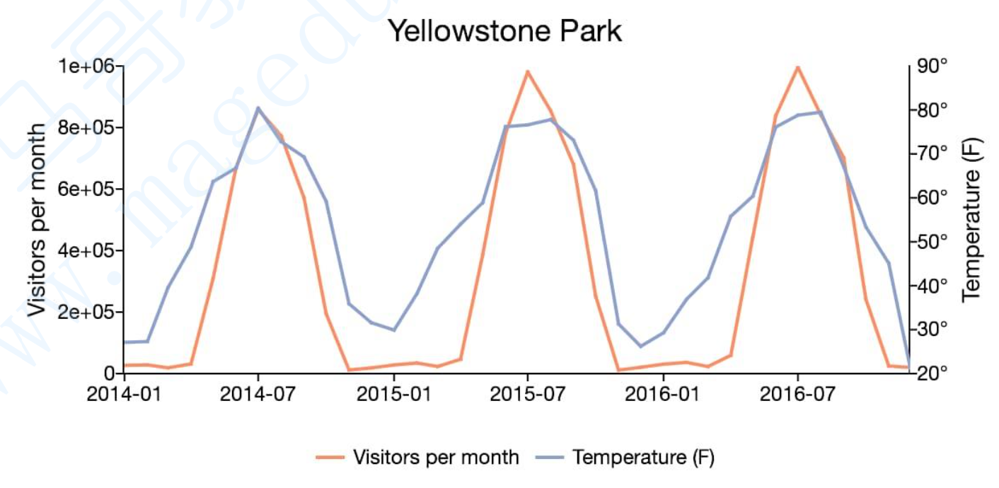
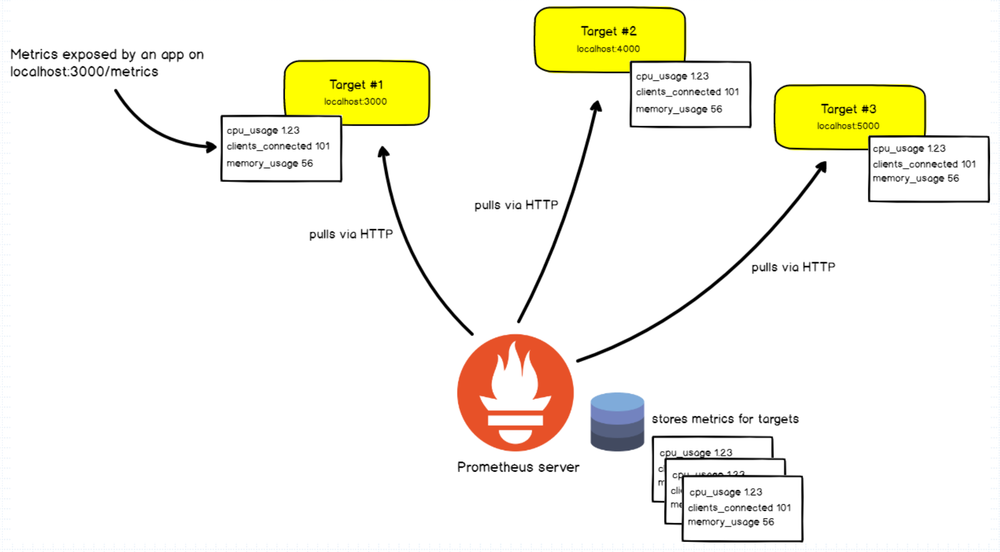
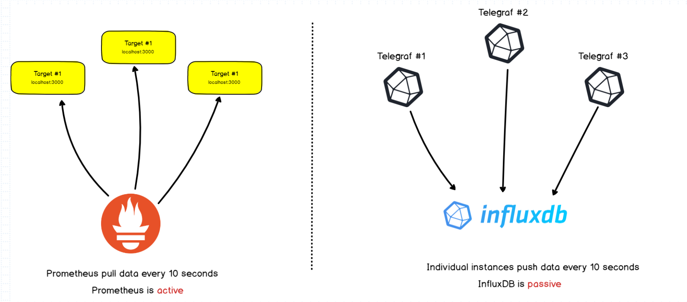
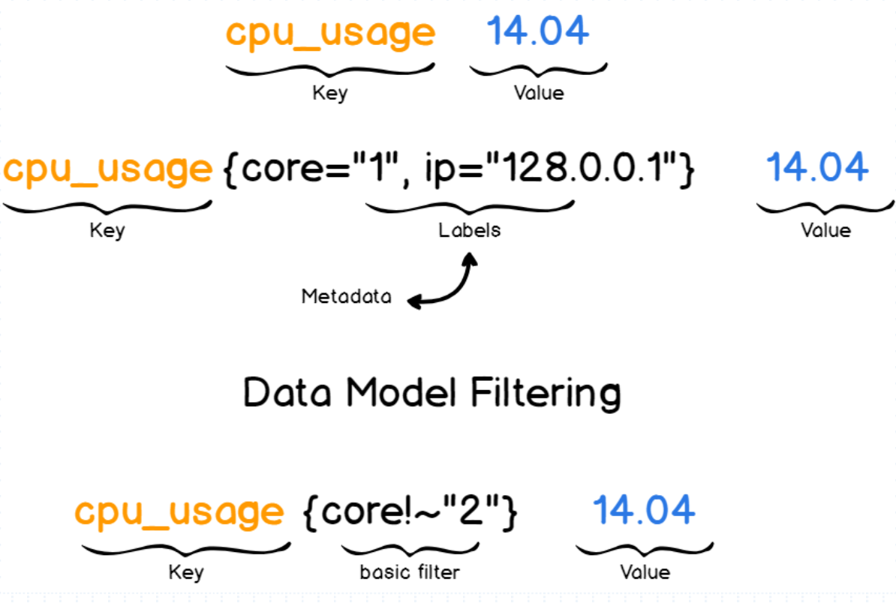

## **What is Prometheus Monitoring?** 

Prometheus是一款时序（time series）数据库；但它的功能却并非止步于TSDB，而是一款设计用于进行目标（Target）监控的关键组件；

结合生态系统内的其它组件，例如pushgateway、altermanager和grafana等，可构成一个完整的IT监控系统；

## **时序数据简介**

时序数据，是在一段时间内通过重复测量（measurement）而获得的观测值的集合；将这些观测值绘制于图形之上，它会有一个数据轴和时间轴；

服务器指标数据、应用程序性能监控数据、网络数据等，也都是时序数据；

## **What does Prometheus do?**

Prometheus基于HTTP call，从配置文件中指定的网络端点（endpoint）上周期性获取指标数据

- Exporters
- Instrumentation
- Pushgateway

## **Pull and Push**

Prometheus同其它TSDB相比又一个非常典型的特效：它主动从各Target上"`拉取（pull）`"数据,而非等待被监控端的"`推送（push）`"；

两个方式各有优劣，其中pull模型的优势在于:
- 集中控制：有利于将配置集在Prometheus Server上完成，包括指标及才去速率等；
- Prometheus的根本目标在于收集Target上预先完成聚合的聚合型数据，而非一款由事件驱动的存储系统；

## **Prometheus的生态组件**

Prometheus生态圈中包含了多个组件，其中部分组件可选

- Prometheus Server：收集和存储事件序列和数据；

- Client Library： 客户端库，目的在于为那些期望原生提供Instrumentation功能的应用程序提供便捷的开发途径；
- Push Gateway： 接收那些通常由短期作业生成的指标数据的网关，并支持有Prometheus Server进行指标拉取操作；
- Exporters：用于暴露现有应用程序或服务(不支持Instrumentation)的指标给Prometheus Server；
- Alertmanager：从Prometheus Server接收到"告警通知"后，通过去重、分组、路由等预处理功能后以高效向用户完成告警信息发送；
- Data Visualization：Prometheus Web UI(Prometheus Server内建)，及Grafana等；
- Service Discovery：动态发现待监控的Target，从而完成监控配置的重要组件，在容器化环境中尤为有用；该组件目前由Prometheus Server内建支持；

## **Prometheus数据模型**

Prometheus仅用于以"键值"形式存储时序式的聚合数据，它并不支持存储文本信息；

- 其中的"键"称为指标（Metric），它通常意味着CPU速率、内存使用率或分区空闲比例等；

- 同一指标可能会适配到多个目标或设备，因而它使用"标签"作为元数据，从而为Metric添加更多的信息描述维度；

- 这些标签还可以作为过滤器进行指标过滤及聚合运算；

## **指标类型（Metric Types）**

Prometheus使用4种方法来描述监视的指标：

- Counter：计数器，用于保存单调递增型的数据，例如站点访问次数等；不能为负值，也不支持减少，但可以重置回0；

- Gauge：仪表盘，用于存储有着起伏特征的指标数据，例如内存空间大小等；

!!! tip "Gauge"
    Gauge是Counter的超集；但存在指标数据丢失的可能性时，Counter能让用户确切了解指标随时间的变化状态，而Gauge则可能随时间流逝而精准度越来越低；

- Histogram：直方图，它会在一段时间范围内对数据进行采样，并将其进入可配置的bucket之中；Histogram能够存储更多的信息，包括样本值分布在每个bucket（bucket自身的可配置）中的数量、所有样本值之和以及总的样本数量，从而Prometheus能够使用内置的 函数进行如下操作：
    - 计算样本平均值：以值的总和除以值的数量
    - 计算样本分位值：分位数有助于了解符合特定标准的数据个数；例如评估响应时长超过1秒钟的请求比例，若超过20%即发送告警等；

- Summary：摘要，Histogram的扩展类型，但它是直接由被监测端自行聚合计算出分位数，并将计算结果响应给Prometheus Server的样本采集请求；因而，其分位数计算是由监控端完成；